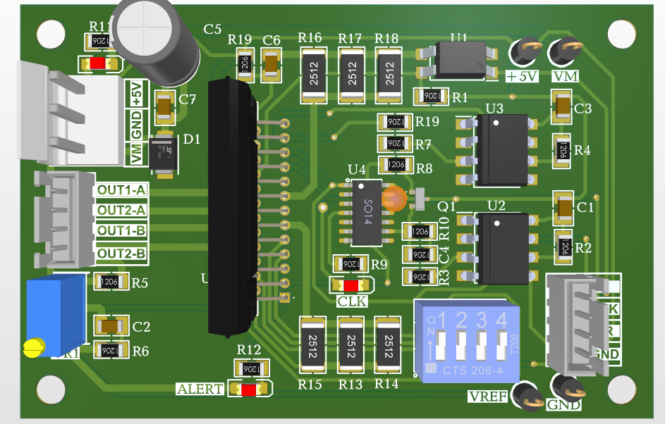
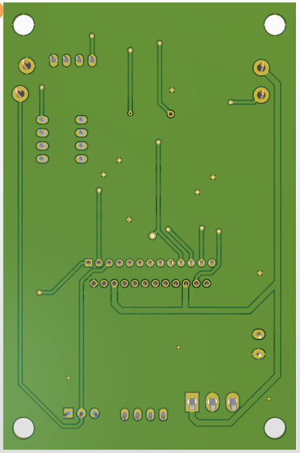
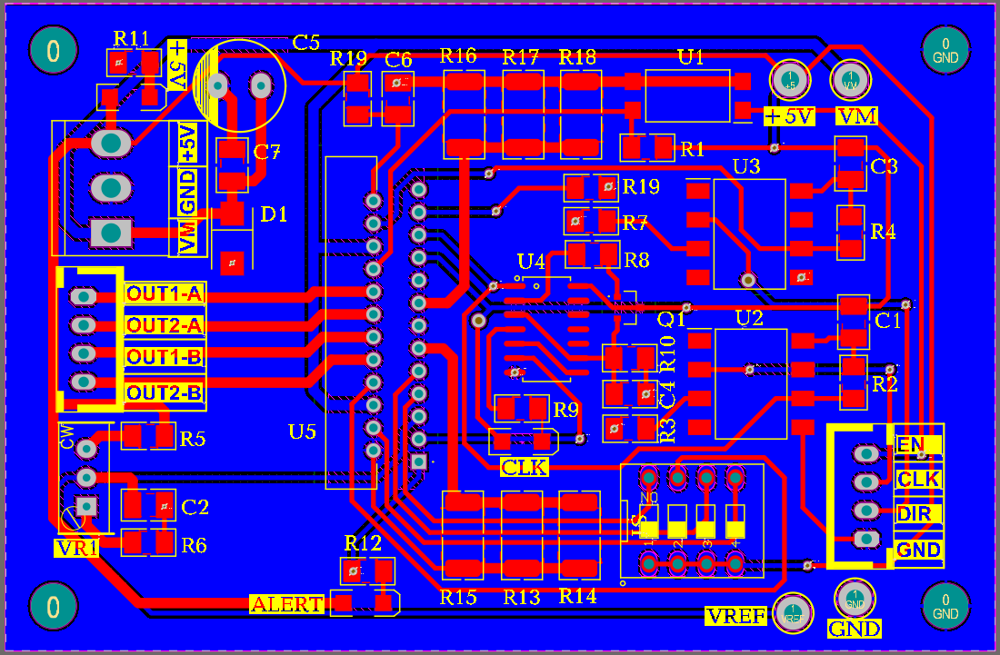
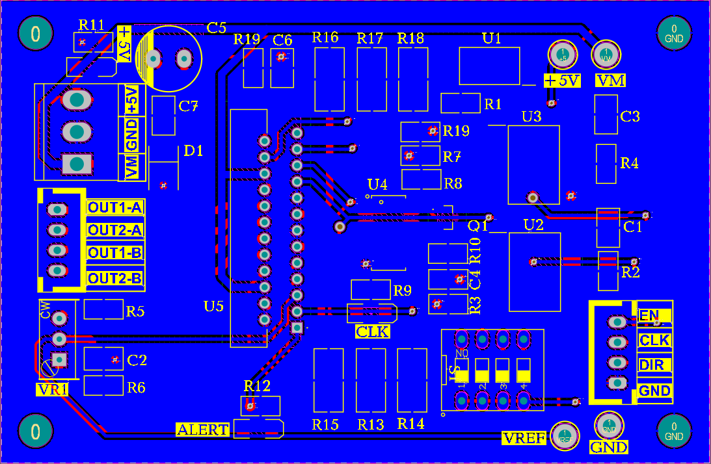

# TB6600 Stepper Motor Driver

Altium Designer PCB layout and schematic for a high-power stepper motor driver module based on the TB6600 IC (up to 4.0A, 9-42V DC).

## Technical Specifications
* **Operating Voltage:** 9V - 42V DC
* **Output Current:** Up to 4.0A Peak
* **Microstep Resolution:** 1, 1/2, 1/4, 1/8, 1/16, 1/32
* **PCB Layers:** 2-Layer Board
* **Protections:** Over-current, Over-temperature, Under-voltage

## Previews & Documentation
* 📄 [Download Schematic PDF](./TB6600_schematic.pdf)
* 📊 [View Bill of Materials (BOM)](./BOM_TB6600.xlsx)

### 3D Model Views
| Top View | Bottom View |
| :---: | :---: |
|  |  |

### PCB Layout
| Layer Top | Layer Bottom |
| :---: | :---: |
|  |  |

---
*Designed with Altium Designer*
